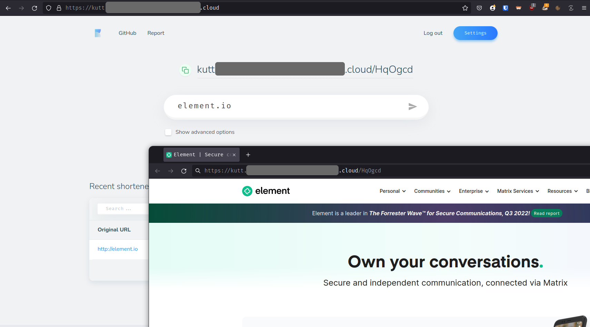

# Helm chart for Kutt

:warning: **This is just a POC** :warning:

Unofficial Helm charts for [kutt](https://github.com/thedevs-network/kutt), an URL shortener.

## Usage

Given you've a Kubernetes cluster with an ingress controller, plus External DNS & certificate-manager to automatically create a DNS records & get a certificate, plus the pod autoscaler setup up, write a `values-override.yaml` file with something like

```yaml
ingress:
  enabled: true
  # className: contour
  annotations:
    cert-manager.io/cluster-issuer: letsencrypt-prod
    ingress.kubernetes.io/force-ssl-redirect: "true"
    kubernetes.io/tls-acme: "true"
  hosts:
    - host: kutt.YOUR.DOMAIN
      paths:
        - path: /
          pathType: Prefix
  tls:
    - secretName: kutt-certificate
      hosts:
        - kutt.YOUR.DOMAIN

autoscaling:
  enabled: true
  minReplicas: 2

env:
  SITE_NAME: kutt
  DEFAULT_DOMAIN: kutt.YOUR.DOMAIN
  JWT_SECRET: GENERATE_ME
  DB_HOST: kutt-postgresql # depends on the name of your Helm release, here it's "kutt"
  MAIL_HOST: mail.YOUR.PROVIDER
  MAIL_PORT: 587
  MAIL_USER: KUTT@YOUR.PROVIDER
  MAIL_PASSWORD: CHANGE_ME
  REDIS_HOST: kutt-redis-master # depends on the name of your Helm release, here it's "kutt"
```

Then

```bash
# Install
helm install kutt . --create-namespace --namespace kutt -f values.yaml -f values-override.yaml
# Upgrade
helm install kutt . --namespace kutt -f values.yaml -f values-override.yaml
```

And head to https://kutt.your.domain



Cleanup

```bash
kubectl delete namespace kutt
```
